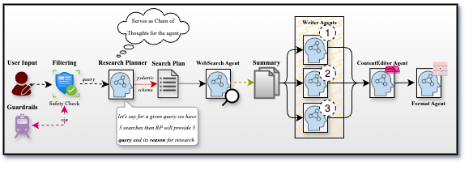

# 🤖 Content Generator: Multi-Agent AI Blog Writing Engine

## 🚀 **[Try Live Demo](https://huggingface.co/spaces/sharmanikhiljiit/Content_Generator)** - Experience the power of multi-agent AI content generation in real-time!



Transform any topic into a professionally crafted blog post through an intelligent orchestration of specialized AI agents working in perfect harmony. Imagine providing a simple topic like "The Future of Renewable Energy" and watching as eight distinct AI agents collaborate seamlessly: strategists plan comprehensive research, investigators scour the web concurrently, three creative writers craft diverse perspectives, critics evaluate quality, and formatters polish the final masterpiece—all while sophisticated guardrails ensure safety and compliance. This is a multi-agent system built with async processing for efficient performance, capable of producing SEO-optimized, publication-ready blog posts in under 90 seconds, complete with meta descriptions, tags, reading time estimates, and professional formatting. Whether you're a content creator looking to streamline your workflow, a developer interested in multi-agent systems, or someone needing consistent content output, this project offers a practical solution for automated blog writing. What makes it useful is its hands-off capability: once you provide a topic, the entire pipeline executes autonomously with minimal human intervention required. The system handles everything from research planning to final formatting, making content creation as simple as entering a topic and clicking generate.

## 🔬 Multi-Agent Architecture

At the heart of Content Generator lies a sophisticated multi-agent orchestration system featuring eight specialized AI agents, each with distinct roles and expertise:

### Research & Planning Agents
- **ResearchPlanner**: Strategic thinker that analyzes topics and creates optimized search queries
- **WebResearcher**: Investigative agent that performs web searches and synthesizes findings

### Content Creation Agents
- **ProfessionalWriter**: Clear, informative writing with practical insights
- **ConversationalWriter**: Engaging, story-driven content that connects emotionally
- **AnalyticalWriter**: Data-driven writing backed by research and evidence

### Quality Assurance Agents
- **ContentEditor**: Critical evaluator that assesses drafts and selects the best content
- **BlogFormatter**: Technical specialist that handles SEO optimization and professional formatting

## 🧠 Multi-LLM Orchestration

Content Generator implements intelligent multi-model orchestration, allowing seamless switching between AI providers based on requirements and cost considerations:

### Gemini 2.5 Flash (Primary)
- **Free tier** with excellent performance for blog writing
- Built-in web search capabilities
- Optimized for creative content generation
- Lower latency and cost-effective for most use cases

### GPT-4o-mini (Premium)
- **Paid model** for enhanced quality when budget allows
- Superior reasoning capabilities for complex topics
- OpenAI WebSearchTool integration for premium research
- Best-in-class content evaluation and editing

### Intelligent Routing
The system automatically routes different tasks to the most appropriate model—creative writing to Gemini for cost efficiency, critical evaluation to GPT-4o-mini for quality assurance—creating an optimal balance of performance and cost.

## 🎯 Agentic Handling & Autonomous Operation

Content Generator exemplifies true agentic AI through its autonomous decision-making and self-directed workflow:

### Self-Directed Research
Agents independently plan research strategies, determining optimal search queries and methodologies without human guidance.

### Quality-Driven Selection
The ContentEditor agent autonomously evaluates multiple drafts using sophisticated criteria, making editorial decisions that rival human content directors.

### Adaptive Content Optimization
Agents automatically adjust writing styles and optimization strategies based on detected content requirements and platform specifications.

## ✋ Hands-Off Automation

Once initialized, the system requires zero human intervention throughout the entire content creation pipeline:

### Single-Input Operation
Provide a topic → Receive a complete, publication-ready blog post. No intermediate steps, no manual research, no copy editing required.

### Autonomous Error Handling
Built-in retry mechanisms and fallback strategies ensure reliable operation even with network issues or API limitations.

### End-to-End Processing
From topic ideation to final formatting, every aspect of content creation is automated while maintaining professional quality standards.

## 🛡️ Multi-Layer Guardrails System

Content Generator implements comprehensive safety and quality guardrails that operate at every stage of the pipeline:

### Content Safety Guardrails
- **Political Content Filtering**: Automatic detection and blocking of political topics, government discussions, and sensitive geopolitical content
- **Input Validation**: Topic length limits and content safety checks before processing begins
- **Output Sanitization**: Draft filtering to ensure all generated content meets safety standards

### Quality Assurance Guardrails
- **Structural Validation**: Medium-optimized content receives automated structure scoring (hook effectiveness, engagement elements, reading flow)
- **SEO Compliance**: Automatic checks ensure content meets search engine optimization standards
- **Format Integrity**: Pydantic models enforce consistent data structures and prevent malformed output

### Platform-Specific Guardrails
- **Medium Optimization**: Specialized validation for Medium's engagement algorithms and formatting requirements
- **HTML Sanitization**: Professional formatting ensures clean, standards-compliant HTML output
- **Accessibility Compliance**: Alt text generation and semantic HTML structure for web accessibility

### Operational Guardrails
- **API Rate Limiting**: Intelligent handling of API quotas and rate limits across multiple providers
- **Error Recovery**: Automatic retry mechanisms and fallback strategies for network issues
- **Resource Management**: Memory-efficient processing with concurrent operation limits

## ⚡ Quick Start

### Prerequisites
- Python 3.8+
- Google AI API key ([Get free key](https://aistudio.google.com/app/apikey))

### Installation

```bash
# Install dependencies
pip install -r requirements.txt

# Setup environment (interactive)
python scripts/setup.py
```

**Why Gemini?** Completely free with excellent blog writing performance and built-in safety features.

### Deployment Options

**Local Development**: Run `python run.py` and open `http://localhost:7860`

**Hugging Face Spaces**: Set `GOOGLE_API_KEY` and  `OPENAI_API_KEY` in Space secrets for instant deployment

**Docker**: Container-ready with environment-based configuration

## 🚀 Usage

### Web Interface (Recommended)

Launch the beautiful, modern web interface with a single command:

```bash
python run.py
```

Navigate to `http://localhost:7860` for an intuitive experience featuring real-time generation, professional blog previews, and flexible configuration options. Choose between free Gemini search or paid OpenAI WebSearchTool, select your preferred AI model, and adjust research depth—all through a clean, responsive interface.

### Command Line Interface

For automation, scripting, or headless operation:

```bash
# Simple usage with free Gemini
python run.py --cli "The Future of Artificial Intelligence in 2025"

# Advanced configuration
python run.py --cli "Machine Learning Best Practices" \
  --model gpt-4o-mini \
  --search-provider openai \
  --searches 5 \
  --output results.json

# Direct CLI access
python src/cli/cli.py "Your Topic" --model gemini --medium
```

### Content Safety

The system automatically filters sensitive topics to ensure safe, compliant content generation. Political discussions, government policies, and controversial topics are blocked, while technology, business, education, and industry topics are fully supported.

## 🏗️ Architecture Overview

### Core Components
The system is organized into focused modules for maintainability and scalability:

- **Core Engine** (`src/core/`): Agent definitions, orchestration logic, and data schemas
- **Web Interface** (`src/web/`): Modern Gradio-based UI with real-time feedback
- **CLI Tools** (`src/cli/`): Command-line interface for automation and scripting
- **Utilities** (`src/utils/`): Content processing, safety guardrails, and helper functions

### Agent Ecosystem
Eight specialized AI agents collaborate through a carefully orchestrated pipeline:

**Research & Planning**: ResearchPlanner creates strategic search queries, WebResearcher executes concurrent web searches

**Content Creation**: Three distinct writing agents (Professional, Conversational, Analytical) generate diverse content perspectives

**Quality Assurance**: ContentEditor evaluates drafts and selects optimal content, BlogFormatter produces publication-ready output

## 💰 Cost Optimization

### Free Tier (Recommended)
- **Gemini 2.5 Flash**: Completely free with excellent performance
- **Built-in Search**: No search costs, unlimited queries
- **Production Ready**: Suitable for most commercial applications

### Premium Tier
- **GPT-4o-mini**: Enhanced quality for critical content ($0.002/1K tokens)
- **OpenAI WebSearchTool**: Premium search results ($0.025 per search)
- **Advanced Features**: Superior reasoning for complex topics

### Usage Monitoring
Track costs through OpenAI's dashboard and optimize by routing simpler tasks to Gemini while reserving GPT-4o-mini for evaluation and complex writing.

## 🔧 Customization

### Adding Writing Styles
Extend the agent ecosystem by defining new writer agents in `src/core/blog_agents.py`:

```python
def get_technical_writer(model_name: str = "gemini"):
    return Agent(
        name="TechnicalWriter",
        instructions="""Write detailed technical content with code examples...""",
        model=get_model(model_name),
        output_type=BlogContent,
    )
```

### Adjusting Research Depth
Modify search parameters in the orchestrator or through CLI flags for different content types and research requirements.

## 🚨 Troubleshooting

**API Key Issues**: Ensure your `.env` file contains valid API keys for Google AI (Gemini) or OpenAI (GPT models)

**Content Safety Errors**: The system automatically filters political topics. Focus on technology, business, education, or industry topics

**Import Errors**: Run `pip install -r requirements.txt` to ensure all dependencies are installed

**Performance Tuning**: Adjust search depth based on topic complexity—simple topics need 2-3 searches, complex research-heavy topics may benefit from 6-7 searches

## 🤝 Contributing

The modular agent architecture invites extension and experimentation:

- **New Writing Styles**: Add specialized writer agents for different content types
- **Research Tools**: Integrate additional search providers or analysis tools
- **Safety Guardrails**: Enhance content filtering for specific use cases
- **Platform Optimization**: Add formatters for different publishing platforms

## 📈 Performance & Scaling

The async architecture enables horizontal scaling—multiple blog generation requests can run concurrently without blocking. The agent-based design allows for easy distribution across multiple machines or containers for high-volume content production.

## 🔒 Enterprise Security

- **Zero API Key Exposure**: Environment-based configuration prevents credential leaks
- **Content Compliance**: Multi-layer safety guardrails ensure brand-safe content
- **Audit Trail**: Structured logging enables content generation tracking
- **Data Sovereignty**: All processing occurs locally with no external data storage

---

**Content Generator v1.0** is a multi-agent AI system for automated blog content creation. By combining specialized AI agents with safety mechanisms and professional formatting, it delivers production-ready blog content with minimal human intervention.

Built with scalability, safety, and performance in mind, this system shows how multi-agent orchestration can streamline content workflows while maintaining quality and compliance.
